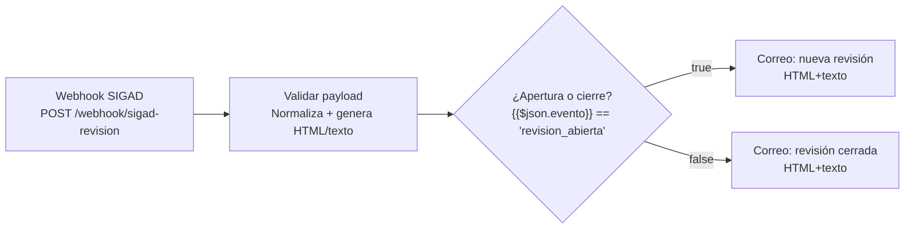

# Sistema Inteligente de Gestión y Análisis Documental (SIGAD)

**Proyecto Integrador — Desarrollo de Aplicaciones Empresariales (VI semestre)**
**UTS — Docente: Wilson Castaño Galviz**
**Integrantes: Joshua David Tarazona Gómez, Karen Lizeth Arenas Medina**

---

## Descripción del proyecto

SIGAD es un sistema web que automatiza la **gestión y el análisis documental** mediante
inteligencia artificial. Implementa el flujo completo:

**archivo → extracción de contenido (OCR) → procesamiento IA → análisis → almacenamiento →
búsqueda/consulta → respuesta.**

El caso de negocio corresponde a la empresa ficticia **Distribuidora Andina S.A.S.**,
que enfrentaba documentos dispersos, búsquedas manuales de 15–40 minutos y escaneos sin texto
utilizable. SIGAD digitaliza, indexa, clasifica y permite consultar el acervo documental en
segundos.

### Capacidades principales

- **Carga de documentos** en PDF, DOCX, TXT, JPG y PNG (validación de tipo, tamaño y "magic bytes").
- **OCR / extracción de texto** para documentos escaneados e imágenes (PaddleOCR + Tesseract).
- **Clasificación automática** en 5 categorías: factura, guía de despacho, orden de compra,
  contrato y acta de recepción, con revisión humana cuando la confianza es baja (< 70%).
- **Extracción de metadatos** (número, fecha, proveedor/cliente, total, plazos, etc.).
- **Resumen automático** de cada documento.
- **Búsqueda por palabras clave** y **búsqueda semántica** (embeddings + pgvector).
- **Consulta conversacional (RAG)**: preguntas en lenguaje natural con respuesta **citando
  las fuentes** de la base documental.
- **Dashboard** con estadísticas de procesamiento, clasificación y consultas.
- **Seguridad**: autenticación JWT, control de acceso por roles y auditoría de acciones.

## Arquitectura y tecnología

| Capa | Tecnología |
|---|---|
| Frontend | React 18 + TypeScript + Vite |
| Backend | Python 3.11 + FastAPI (REST) |
| Base de datos | PostgreSQL 16 + extensión **pgvector** (índice HNSW) |
| Almacenamiento | MinIO (S3) o carpeta local |
| IA | OCR (PaddleOCR/Tesseract) + embeddings (`text-embedding-3-small`) + LLM (`gpt-4o-mini`) vía **RAG** |
| Despliegue | Docker Compose (ambiente reproducible) |

La justificación técnica de la integración de IA se encuentra en
`02-Documento-Diseno/07-Diseno-integracion-IA`.

## Estructura del repositorio

| # | Carpeta | Contenido | Estado |
|---|---|---|---|
| 1 | `01-Documento-Analisis` | Análisis del problema, alcance, actores, RF/RNF, historias, casos de uso, riesgos | ✅ Documentado |
| 2 | `02-Documento-Diseno` | Arquitectura, modelo ER, diccionario, API, flujo documental, integración IA, seguridad | ✅ Documentado |
| 3 | `03-Documento-Desarrollo` | Entorno, configuración, estructura, implementación por módulos, bitácora | ✅ Documentado |
| 4 | `04-Plan-Evidencias-Pruebas` | Plan, 16 casos de prueba, defectos, matrices y conclusiones | ✅ Documentado |
| 5 | `05-Documento-Implementacion-Despliegue` | Ambiente, requisitos, despliegue, respaldo y mantenimiento | ✅ Documentado |
| 6 | `06-Manual-Usuario` | Manual de uso del sistema | ✅ Documentado |
| 7 | `07-Manual-Tecnico-Administracion` | Manual técnico y de administración | ✅ Documentado |
| 8 | `08-Matriz-Trazabilidad` | Trazabilidad general requisito → prueba | ✅ Documentado |
| 9 | `09-Codigo-Fuente` | Código fuente (backend, frontend, IA, docker-compose) | ⬜ Pendiente |
| 10 | `10-Base-Datos-Scripts` | Scripts SQL MySQL: esquema, datos iniciales y consultas de reportes | ⬜ Pendiente |
| 11 | `11-Repositorio-Documentos-Prueba` | 36 documentos de prueba en 5 categorías y 4 formatos | ⬜ Pendiente |
| 12 | `12-Evidencias-Funcionamiento` | Evidencias de pruebas de funcionamiento (PDF) | ⬜ Pendiente |

## Automatización con n8n — Revisión humana inteligente

La clasificación con confianza < 70% activa una revisión humana inteligente: SIGAD envía un webhook a n8n para notificar al analista por correo. El humano resuelve en `/app/revision` y SIGAD envía el evento de cierre para notificarlo.

### Flujo
`clasificación < 70% → requiere_revision → webhook n8n → correo → revisión en SIGAD (/app/revision) → decisión → proceso → notificación de cierre`

### Nodos
| Nodo | Tipo | Rol |
|---|---|---|
| Webhook SIGAD | `n8n-nodes-base.webhook` (v2) | POST `/webhook/sigad-revision`. Recibe `evento`, `documento_id`, `documento`, `categoria_sugerida`, `confianza`, `resumen`, `url_revision`, `decision`, `estado` (cuerpo en `body`). |
| Validar payload | `n8n-nodes-base.code` | Normaliza (`p.body ?? p`). Genera `asunto_*`, `cuerpo_*` (texto plano) y `cuerpo_*_html` (HTML inline). Escapa contenido para evitar inyección HTML. |
| ¿Apertura o cierre? | `n8n-nodes-base.if` (v2) | `{{$json.evento}} == 'revision_abierta'` → true=apertura, false=cierre. |
| Correo: nueva revisión | `n8n-nodes-base.emailSend` (v2) | Envía aviso pendiente (formato `both`: HTML + texto plano) vía SMTP. |
| Correo: revisión cerrada | `n8n-nodes-base.emailSend` (v2) | Envía aviso de cierre (formato `both`: HTML + texto plano) vía SMTP. |

### Diagrama


### Conexiones
- `Webhook SIGAD.main` → `Validar payload.main`
- `Validar payload.main` → `¿Apertura o cierre?.main`
- `¿Apertura o cierre?.main[0]` → `Correo: nueva revisión.main`
- `¿Apertura o cierre?.main[1]` → `Correo: revisión cerrada.main`

### Notas
- Eventos: `revision_abierta` / `revision_cerrada`. Webhook *fire-and-forget*. Si n8n no está disponible, SIGAD registra `n8n.webhook_error` en auditoría.
- Workflow: `workflow-sigad-revision.json` (raíz). n8n v2.41.6 usa draft/published (activar tras importar). `webhookId: sigad-revision`.

## Instalación rápida

> Requiere Docker Desktop y una API key de OpenAI (para embeddings y LLM).

```bash
git clone https://github.com/JosdaTara/Gesti-n-Documental-IA.git
cd 09-Codigo-Fuente
cp backend/.env.example backend/.env   # completar OPENAI_API_KEY y JWT_SECRET
docker compose up --build -d
```

| Servicio | URL |
|---|---|
| Frontend | http://localhost:5173 |
| API (Swagger) | http://localhost:8000/docs |
| MinIO consola | http://localhost:9001 |

Detalle completo: `03-Documento-Desarrollo/05-Manual-tecnico-instalacion` y
`05-Documento-Implementacion-Despliegue/06-Proceso-instalacion`.

## Datos de evaluación

| Entregable | Peso |
|---|---|
| Análisis | 20% |
| Diseño | 20% |
| Desarrollo | 20% |
| Plan de evidencias y pruebas | 15% |
| Implementación y despliegue | 10% |
| Matriz de trazabilidad | 5% |
| Presentación y sustentación | 10% |

## Recordatorios clave del enunciado

- La IA debe demostrar el flujo real: archivo → extracción → procesamiento IA → análisis →
  almacenamiento → búsqueda/consulta → respuesta.
- Justificar técnicamente el modelo/API/técnica usada (RAG, embeddings, búsqueda semántica,
  NLP, OCR).
- Mínimo 30 documentos de prueba, 3+ categorías, sin datos personales reales sin autorización.
- Mínimo 10 casos de prueba documentados (el proyecto cuenta con 16).
- **Nunca subir API keys/credenciales al repositorio** — usar variables de entorno.
- Todos los integrantes deben poder sustentar el proyecto completo.
